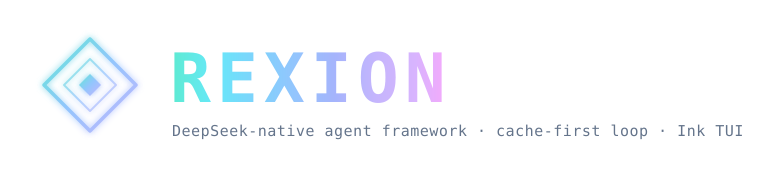

<p align="center">
  
</p>

<p align="center">
  <strong>English</strong>
  &nbsp;·&nbsp;
  <a href="./README.zh-CN.md">简体中文</a>
  &nbsp;·&nbsp;
  <a href="./docs/SPEC.md">Spec</a>
  &nbsp;·&nbsp;
  <a href="https://esengine.github.io/DeepSeek-Rexion/">Website</a>
  &nbsp;·&nbsp;
  <strong><a href="https://discord.gg/XF78rEME2D">Discord</a></strong>
</p>

> [!IMPORTANT]
> **Rexion 1.0 is a ground-up rewrite in Go** — this branch (`main-v2`) is the new default and where development happens now.
> The earlier `0.x` TypeScript releases are **legacy**, living on the [`v1`](https://github.com/esengine/DeepSeek-Rexion/tree/v1) branch (maintenance only).
> See the **[migration guide](./docs/MIGRATING.md)**. `npm i -g Rexion` stays the install command — `1.0.0`+ delivers the Go binary, `0.x` is the legacy TS build.

<p align="center">
  <a href="https://www.npmjs.com/package/Rexion"></a>
  <a href="https://github.com/esengine/Rexion/actions/workflows/ci.yml"></a>
  <a href="./LICENSE"></a>
  <a href="https://www.npmjs.com/package/Rexion"></a>
  <a href="https://github.com/esengine/Rexion/stargazers"></a>
  <a href="https://atomgit.com/esengine/DeepSeek-Rexion"></a>
  <a href="https://github.com/esengine/Rexion/graphs/contributors"></a>
  <a href="https://github.com/esengine/Rexion/discussions"></a>
  <a href="https://discord.gg/XF78rEME2D"></a>
</p>

<p align="center">
  <a href="https://oosmetrics.com/repo/esengine/Rexion"></a>
  <a href="https://oosmetrics.com/repo/esengine/Rexion"></a>
  <a href="https://oosmetrics.com/repo/esengine/Rexion"></a>
</p>

<br/>

<h3 align="center">A DeepSeek-native AI coding agent for your terminal.</h3>
<p align="center">A config- and plugin-driven harness — a single static Go binary, tuned around DeepSeek's prefix cache so token costs stay low across long sessions.</p>

<br/>

> [!IMPORTANT]
> **Community · 加入社区** — bilingual Discord for setup help (`#help` / `#求助`), workflow showcases, and feature ideas. → **<https://discord.gg/XF78rEME2D>**

<br/>

## What's New

Rexion now ships a full **agentic workbench** — multi-agent isolation, browser
automation, global memory, and a desktop experience designed for parallel work.

| Capability | What it means for you |
|------------|----------------------|
| **Multi-agent worktree isolation** | Spawn parallel workers without file conflicts — each agent gets its own git worktree under `.rexion/worktrees/`, merged back via `merge_worktree`. |
| **Browser automation** | Drive a headless Chrome over CDP (`browser_navigate` / `browser_click` / `browser_type` / `browser_screenshot`) — UI tests, form fills, and visual verification. |
| **Global memory** | Cross-project knowledge (`~/.config/rexion/memory/`) flows into every session on top of per-project `AGENTS.md`. Remember once, apply everywhere. |
| **PR & CI automation** | `pr_monitor` watches PR state and checks; `auto_fix_ci` pulls failing logs, suggests fixes, and (on approval) applies them. |
| **IM remote control** | Trigger agents from DingTalk / Feishu / WeCom with `/ask`, `/plan`, `/craft` modes — sensitive ops need confirmation. |
| **Skills marketplace** | `rexion skill search/install` pulls community skills from a GitHub-backed registry; the desktop Skills Browser installs in one click. |
| **Design → code** | Upload a screenshot or Figma URL; `rexion-plugin-design` analyzes layout and emits HTML/Vue/React. |
| **Computer Use** | `rexion-plugin-computer` drives the desktop (click, type, screenshot, app switch) under a live supervision overlay. |
| **Cross-device sessions** | `rexion session push/pull` syncs conversations between CLI, desktop, and mobile via file or HTTP backend. |
| **Desktop multi-session** | `SessionSidebar`, `SideChat`, and a draggable `DraggableLayout` let you run several agents side by side. |

## Features

- **Config-driven.** Providers, the agent, enabled tools, and plugins are all
  declared in `Rexion.toml`. No hardcoded models.
- **Multi-model & composable.** DeepSeek (flash/pro) and MiMo ship as presets;
  any OpenAI-compatible endpoint is a config entry, not new code. Optionally run
  two models together (executor + planner) in separate, cache-stable sessions.
- **Plugin-driven.** External tools run as subprocesses over stdio JSON-RPC
  (MCP-compatible). Built-in tools self-register at compile time.
- **Code intelligence via CodeGraph.** A tree-sitter symbol/call graph
  (`codegraph_*` tools) replaces embedding semantic search — no embedding
  service or API cost. Fetched into a local cache on first use (or
  `Rexion codegraph install`) and indexed in the background.
- **Skills & hooks.** Claude-Code-style skills (`internal/skill`) and hooks
  (`internal/hook`), symlink-aware and slash-integrated. Skills are Markdown
  playbooks the model invokes via `run_skill` (or you via `/<name>`); hooks
  run shell commands around the loop (`PreToolUse` / `PostToolUse` /
  `UserPromptSubmit` / `Stop`).
- **Multi-agent with worktree isolation.** `spawn_agent` gives each worker its
  own git worktree so parallel edits never collide; `merge_worktree` brings
  changes back with conflict reporting.
- **Global + project memory.** Per-project `AGENTS.md` plus a cross-project
  memory store at `~/.config/rexion/memory/` — preferences and decisions
  persist across sessions and projects.
- **Zero-friction distribution.** `CGO_ENABLED=0` single binary; cross-compile
  to six targets with one command. The only dependency is a TOML parser.

## Install

```sh
npm i -g Rexion                  # any OS; pulls the prebuilt native binary
brew install esengine/Rexion/Rexion   # macOS
```

Prebuilt archives (`darwin|linux|windows × amd64|arm64`) and `SHA256SUMS` are on
every [GitHub release](https://github.com/esengine/DeepSeek-Rexion/releases).

### Build from source

```sh
make build      # -> bin/Rexion(.exe)
make cross      # -> dist/ (darwin|linux|windows × amd64|arm64)
```

## Quick start

```sh
Rexion setup                      # config wizard → ./Rexion.toml
export DEEPSEEK_API_KEY=sk-...  # or put it in .env (see .env.example)
Rexion chat                       # then run /init to generate AGENTS.md (project memory)
Rexion run "implement the TODOs in main.go"
Rexion run --model mimo-pro "add unit tests for this function"
echo "explain this code" | Rexion run
```

### CLI commands

| Command | Description |
|---------|-------------|
| `Rexion chat` | Interactive bubbletea TUI |
| `Rexion run` | One-shot non-interactive |
| `Rexion setup` | Config wizard → `Rexion.toml` |
| `Rexion serve` | HTTP/SSE server frontend |
| `Rexion acp` | Agent Communication Protocol |
| `Rexion mcp` | MCP server management |
| `Rexion mcp-server` | Built-in MCP server |
| `Rexion codegraph` | CodeGraph install / index / status |
| `Rexion doctor` | Environment diagnostics |
| `Rexion config` | Read/write config (incl. `auto-plan`) |
| `Rexion init` | Generate project memory file |
| `Rexion skill search <kw>` | Search the community skills registry |
| `Rexion skill install <name>` | One-click install a skill (`--global`/`--link`) |
| `Rexion skill list-remote` | List skills in the registry by category |
| `Rexion skill update` | Refresh the local skills index cache |
| `Rexion session push [id]` | Push a session to file/HTTP sync backend |
| `Rexion session pull <id>` | Pull a remote session into a new local one |
| `Rexion session list-remote` | List sessions available on the sync backend |

## Configuration

Resolution order: **flag > `./Rexion.toml` > `~/.config/Rexion/config.toml` >
built-in defaults**. Secrets come from the environment via `api_key_env` and are
never stored in config files.

```toml
default_model = "deepseek-flash"   # executor; set [agent].planner_model to add a planner
# language    = "zh"               # ui language; empty = auto-detect from $LANG / $REXION_LANG

[agent]
# planner_model = "mimo-pro"          # optional low-frequency planner
# subagent_model = "deepseek-pro"     # optional default for runAs=subagent skills
# subagent_models = { review = "deepseek-pro", security_review = "deepseek-pro" }
auto_plan = "off"                  # off|on; off keeps plan mode manual
# auto_plan_classifier = "deepseek-flash"   # optional; only borderline tasks call it

[[providers]]
name        = "deepseek-flash"
kind        = "openai"
base_url    = "https://api.deepseek.com"
model       = "deepseek-v4-flash"
api_key_env = "DEEPSEEK_API_KEY"
# also preset: deepseek-pro, mimo-pro (mimo-v2.5-pro), mimo-flash (mimo-v2-flash) @ api.xiaomimimo.com/v1

# Custom provider — any OpenAI-compatible or Anthropic service.
# For OpenAI-compatible proxies/aggregators, set kind = "openai" and base_url.
# base_url without a version segment (e.g. /v1) is auto-normalized at runtime.
[[providers]]
name        = "my-proxy"
kind        = "openai"
base_url    = "https://my-proxy.example.com/v1"
models      = ["gpt-4o", "claude-3-opus"]
default     = "gpt-4o"
api_key_env = "MY_PROXY_API_KEY"

# Anthropic-native provider — kind = "anthropic"; base_url is optional
# (defaults to https://api.anthropic.com). Set it only for proxies.
[[providers]]
name        = "claude"
kind        = "anthropic"
model       = "claude-sonnet-4-20250514"
api_key_env = "ANTHROPIC_API_KEY"

[tools]
enabled = []   # omit/empty = all built-ins; list names to restrict
bash_timeout_seconds = 120   # foreground safety cap; set 0 for no tool-local cap
# [tools.repl]                # js_eval / python_eval; enabled by default
# enabled = true
# js_path = "node"            # path to node binary
# python_path = "python3"     # path to python3 binary

[skills]
# paths = ["~/my-skills", "../shared/skills"]   # extra custom skill roots
# excluded_paths = ["~/.agents/skills"]         # hide convention roots without deleting folders
# disabled_skills = ["review"]                  # hide skills until /skill enable <name>

[permissions]
mode  = "ask"                                # writer fallback when no rule matches: ask|allow|deny
deny  = ["bash(rm -rf*)", "bash(git push*)"] # hard-blocked in every mode
allow = ["bash(go test*)"]                   # never prompted

[sandbox]
# workspace_root = ""          # file-writers confined here; empty = current dir
# allow_write    = ["/tmp"]    # extra dirs write_file/edit_file/multi_edit may touch

[[plugins]]
name    = "example"
command = "Rexion-plugin-example"
```

Permissions gate each tool call: `deny` > `ask` > `allow` > fallback (readers
always allow; writers fall back to `mode`). `Rexion chat` prompts before writers
(`y` once · `a` this session · `n` no); `Rexion run` stays autonomous but still
honours `deny`. See [`docs/SPEC.md`](docs/SPEC.md) for the full schema and contract.

Permissions are *policy* (which calls to allow / prompt). The **sandbox** is
*enforcement*: the file-writers (`write_file` / `edit_file` / `multi_edit`)
refuse any path outside `[sandbox] workspace_root` (default: the current dir, so
edits stay in the project), resolving symlinks and `..` so a link can't tunnel
out. Reads are unrestricted. `bash` is itself jailed on macOS by default
(`[sandbox] bash`, Seatbelt): commands may write only those same roots (plus
temp and toolchain caches) and reach the network only when `[sandbox] network`
is set. Other platforms fall back to running unconfined for now (see
`docs/SPEC.md` §9 for the escape-prompt and Linux support still to come).

### Plugins (MCP)

Rexion is an MCP client. A `[[plugins]]` entry's `type` selects the transport:
`stdio` (default) launches a local subprocess (`command`/`args`/`env`); `http`
(Streamable HTTP) connects to a remote `url` with optional static `headers`
(`${VAR}` / `${VAR:-default}` expanded from the environment, so tokens stay out
of the file). Tools surface to the model as `mcp__<server>__<tool>`; a tool
declaring MCP's `readOnlyHint: true` joins parallel dispatch and the permission
reader-default.

A server's **prompts** surface as `/mcp__<server>__<prompt>` slash commands
(positional args after the command); its **resources** are pulled in by writing
`@<server>:<uri>` in a message; `/mcp` lists connected servers and what each
exposes. `make build` also produces `bin/rexion-plugin-example` — a runnable
reference stdio server (`echo`, `wordcount`, a `review` prompt, a style-guide
resource) you can copy.

#### Official plugins

| Plugin | Binary | Description |
|--------|--------|-------------|
| Office | `rexion-plugin-office` | Word document read/write, Markdown→DOCX, template rendering |
| Sheet | `rexion-plugin-sheet` | Spreadsheet (xlsx/csv) read/write/query/chart |
| Slides | `rexion-plugin-slides` | PowerPoint generation, themes, PDF export |
| Calendar | `rexion-plugin-calendar` | System calendar events & todo items |
| Mail | `rexion-plugin-mail` | Email via IMAP/SMTP, OAuth2, classification |
| IM | `rexion-plugin-im` | Instant messaging (DingTalk / Feishu / WeCom) with `/ask` `/plan` `/craft` remote control |
| Search | `rexion-plugin-search` | Web search, page extraction, comparison tables |
| DWS | `rexion-plugin-dws` | DingTalk Workspace (contacts, docs, AI tables, attendance, approval, drive) |
| Browser | `rexion-plugin-browser` | Chrome DevTools Protocol automation — navigate, click, type, screenshot, evaluate |
| Design | `rexion-plugin-design` | Design-to-code: screenshot/Figma → layout analysis → HTML/Vue/React |
| Computer | `rexion-plugin-computer` | Desktop automation (Windows): click, type, screenshot, app switch, drag — under supervision |
| Example | `rexion-plugin-example` | Reference stdio server implementation |

```toml
[[plugins]]                       # local stdio server
name    = "example"
command = "Rexion-plugin-example"

[[plugins]]                       # remote server over Streamable HTTP
name    = "stripe"
type    = "http"
url     = "https://mcp.stripe.com"
headers = { Authorization = "Bearer ${STRIPE_KEY}" }
```

Enabled MCP servers start connecting automatically in the background after a
session begins, so chat stays usable while tools come online. Use `/mcp` or the
desktop MCP panel to refresh status, reconnect a server, inspect failures, or
disable a server for the current session.

**Already have an `.mcp.json`?** Drop it in the project root and Rexion
reads it as-is — the `mcpServers` spec (`command`/`args`/`env`, `type`/`url`/
`headers`, `${VAR}` expansion) maps field-for-field onto `[[plugins]]`. Both
sources are merged; on a name collision `Rexion.toml` wins.

```json
{
  "mcpServers": {
    "filesystem": { "command": "npx", "args": ["-y", "@modelcontextprotocol/server-filesystem", "/path"] },
    "stripe": { "type": "http", "url": "https://mcp.stripe.com", "headers": { "Authorization": "Bearer ${STRIPE_KEY}" } }
  }
}
```

**Upgrading from `0.x`?** Your old `~/.Rexion/config.json` is still read for its
`mcpServers` (honouring `mcpDisabled`) as a lowest-priority source, so MCP servers
keep working — move them into `Rexion.toml`'s `[[plugins]]` or a `.mcp.json` when
convenient.

### Slash commands

In `Rexion chat`, built-in commands (`/compact`, `/new`, `/rewind`, `/tree`,
`/branch`, `/switch`, `/todo`, `/model`, `/effort`, `/mcp`, `/memory`, `/help`) run locally.
`/tree` shows saved conversation branches, `/branch [name]` forks the current
conversation tip, `/branch <turn> [name]` forks from an earlier checkpointed turn,
and `/switch <id|name>` loads another branch. **Custom commands** are Markdown files under
`.Rexion/commands/` (project) or `~/.config/Rexion/commands/` (user) —
`review.md` becomes `/review`, a subdirectory namespaces it (`git/commit.md` →
`/git:commit`). The body is a prompt template; invoking the command sends it as a
turn.

```markdown
---
description: Review the staged diff
argument-hint: [focus-area]
---
Review the staged diff. Focus on $ARGUMENTS, list bugs with file:line.
```

`$ARGUMENTS` expands to all space-separated args, `$1`…`$N` to positional ones.
MCP prompts also appear here as `/mcp__<server>__<prompt>`.

### @ references

Embed `@` references in a message and Rexion resolves them before sending, as
tagged context blocks: `@path/to/file` (or `@dir`) injects a local file's
contents (or a directory listing), and `@<server>:<uri>` injects an MCP
resource. A local path is only treated as a reference when it actually exists,
so ordinary `@mentions` stay literal. Typing `/` or `@` opens an autocomplete
menu — slash commands, or hierarchical file navigation (one directory level at a
time, descend into folders) plus MCP resources.

### Two-model collaboration (optional)

`Rexion setup` keeps first-run minimal: pick provider → keys (every SKU of a
chosen provider is enabled). Running two models together (executor + planner,
separate cache-stable sessions) is a one-line edit afterwards — set
`planner_model` to any other enabled provider:

```toml
[agent]
planner_model = "deepseek-pro"   # used as the low-frequency planner
```

The planner sees loaded `Rexion.md` / `AGENTS.md` memory and a small read-only
research tool set, so it can inspect relevant files before handing a plan to the
executor. Writer and workflow tools remain executor-only.

Subagent skills inherit the executor model by default. Set `subagent_model` to
run them on another configured model, or use `subagent_models` to override only
specific skills such as `review` or `security_review`.

For interactive frontends, plan mode is manual by default. Set
`agent.auto_plan = "on"` to make complex-looking tasks enter plan mode
automatically: Rexion first drafts a read-only plan, then waits for approval
before editing or running side-effecting commands. Each plan step is signed off
with `complete_step`, which requires evidence (a verification command, a diff,
or a manual check) before the step is marked done — preventing the agent from
silently advancing past unfinished work. `auto_plan_classifier` can
name a cheap provider such as `deepseek-flash`; it is only called for borderline
inputs and falls back to the heuristic if classification fails. Use
`/auto-plan off|on` in `Rexion chat` to change the user-level setting, or
`Rexion config auto-plan off|on` from a shell/script. Pass `--local` to the
shell command only when you intentionally want a project-local override.

### Agentic workbench

Beyond the single-agent loop, Rexion is built for parallel, persistent, and
remote-agent workflows.

**Multi-agent with worktree isolation.** `spawn_agent` launches child agents
(`default` / `worker` / `explorer` / `monitor` roles). When the workspace is a
git repo, each non-readonly worker gets its own worktree at
`.rexion/worktrees/<agent-id>/` on branch `rexion/<agent-id>`, so parallel
edits never collide. `merge_worktree` brings changes back to the main branch
and reports conflicts by file. Worktrees are cleaned up automatically when the
child closes.

**Global memory.** On top of per-project `AGENTS.md`, Rexion keeps a
cross-project memory store at `~/.config/rexion/memory/`. Use the `remember_global`
tool (or the desktop Memory panel) to save preferences, decisions, and contacts
once — they flow into every subsequent session's system prompt. The
`recall_global` tool searches the store by keyword. The auto-learner detects
phrases like "in all my projects I use…" and proposes global memories
automatically.

**PR & CI automation.** The `pr_monitor` tool queries a PR's state and CI
checks via the GitHub CLI (`gh`). `auto_fix_ci` goes further: it pulls the
failing run's logs, matches common error patterns (Go compile errors, generic
`file:line: error`, `--- FAIL:`), and returns a structured fix list. With
`auto_apply=true` and an approval, it applies the suggested edits through
`edit_file`. Configure defaults under `[git]`:

```toml
[git]
# auto_fix_ci = false    # auto-fix CI failures when true (still requires approval per fix)
# auto_merge = false     # auto-merge PR after CI passes (requires branch protection)
```

**IM remote control.** The IM plugin now accepts commands from DingTalk,
Feishu, and WeCom chats:

- `/ask <question>` — answer only, no side effects
- `/plan <task>` — draft a plan first, execute after confirmation (default)
- `/craft <task>` — execute directly
- `/status` — query running sessions
- `/cancel` — cancel a pending command

Sensitive operations (delete, push, deploy, restart) always require a
follow-up `确认` / `cancel` reply within 5 minutes. Work mode is sticky per
chat session. `set_work_mode` / `get_work_mode` / `confirm_im_command` tools
expose the state to the agent.

**Skills marketplace.** `rexion skill search <keyword>` queries a
GitHub-backed registry (default: `esengine/Rexion-skills`), with a 24-hour
local cache for offline use. `rexion skill install <name>` pulls a single
skill (file or git source) into the project or global scope. The desktop
Skills Browser (`Sidebar → Skills 市场`) lets you browse by category, search,
and install in one click.

**Cross-device sessions.** `rexion session push [id]` serializes a session
(messages + metadata) and uploads it to a file (`~/.config/rexion/sync/`) or
HTTP backend. `rexion session pull <remote-id>` imports it as a new local
session. The desktop Session Sync panel shows a QR code of the remote ID for
quick handoff to a phone.

### Desktop

The Wails desktop client (`desktop/`) pairs the terminal loop with a
multi-session workbench:

- **SessionSidebar** — all active and recent sessions, grouped by status
  (running / recent / earlier), with search, inline rename, and right-click
  actions.
- **SideChat** — a pull-out side conversation that shares context with the
  main session without polluting it; drag the edge to resize, promote a side
  exchange back to the main thread when it matures.
- **DraggableLayout** — rearrange the terminal, preview, diff, and editor
  panels by dragging the dividers; double-click a divider to reset; layouts
  persist per panel set to `localStorage`.
- **SkillsBrowser** — install and manage skills from the marketplace without
  leaving the app.
- **DesignPanel** — upload a design mockup or paste a Figma URL, pick a
  framework (HTML / Vue / React), and generate code with a side-by-side diff
  view.
- **SupervisionOverlay** — when Computer Use is active, a floating overlay
  shows each pending action with a screenshot, lets you pause / resume /
  abort, and highlights sensitive operations for a second confirmation.

## Architecture

Three tiers of extensibility, all behind registries the core resolves by name:

1. **Registry** — `Provider` and `Tool` are interfaces; the core has no
   `switch model`.
2. **Compile-time built-ins** — providers (`provider/openai`) and tools
   (`tool/builtin`) self-register via `init()`; `main` blank-imports them.
   Adding a built-in is one file plus one import.
3. **Runtime plugins** — executables declared in config, spoken to over
   newline-delimited JSON-RPC 2.0 on stdin/stdout (the MCP stdio convention).
   Each remote tool is adapted to the `Tool` interface.

## Status

Done: registry-based providers/tools, OpenAI-compatible streaming with tool
calls (bounded retry on 429/5xx), **Anthropic-native provider** (`kind = "anthropic"`),
built-in tools — **file** (`read_file`, `write_file`, `edit_file`, `multi_edit`,
`apply_patch`, `delete_range`, `delete_symbol`), **search** (`glob`, `grep`, `ls`),
**exec** (`bash`, `bash_output`, `kill_shell`, `wait`), **REPL** (`js_eval`,
`python_eval`), **doc gen** (`write_docx`, `write_pdf`, `write_sheet`,
`notebook_edit`), **network** (`web_fetch`), **planning** (`todo_write`,
`complete_step`), **agent** (`task`, `ask`), **multi-agent** (`spawn_agent`,
`wait_agent`, `send_input`, `close_agent`, `merge_worktree` with git worktree
isolation), **memory** (`remember`, `forget`, `remember_global`, `recall_global`
with per-project + global stores), **PR & CI** (`pr_monitor`, `auto_fix_ci`),
**CodeGraph** (`codegraph_context`, `codegraph_search`, `codegraph_node`,
`codegraph_explore`, `codegraph_files`, `codegraph_callees`, `codegraph_callers`,
`codegraph_impact`, `codegraph_status`, `codegraph_trace`) — TOML config, an
interactive `Rexion setup` wizard, two-model collaboration (executor + planner
in separate, cache-stable sessions), low-frequency context compaction,
sub-agents (`task`), a bubbletea chat TUI (markdown, plan mode with
evidence-backed step sign-off via `complete_step`, live token/activity readout,
pinned task list, `ask` question chooser, `/compact` `/new` `/tree` `/branch`
`/switch` `/todo`), session persistence + resume, per-call **permissions**
(allow/ask/deny rules; chat prompts before writers, deny rules hard-block
everywhere), a **workspace sandbox** confining file-writers to the project
(symlink/`..`-safe), **sandboxed bash** (macOS Seatbelt by default; commands may
write only workspace roots + temp/toolchain caches, network only when
`[sandbox] network` is set), an MCP client — **stdio + Streamable HTTP**
transports, tools (`mcp__server__tool`, `readOnlyHint`-aware), prompts (slash
commands), resources (`@`-references), and `/mcp`, configured via `[[plugins]]`
or a project `.mcp.json` — **Skills & hooks** (Claude-Code-style skill playbooks
+ shell-command hooks around the loop, plus a community **skills marketplace**
via `rexion skill search/install`), custom slash commands
(`.Rexion/commands/*.md`), `@file` / `@resource` references, **ACP**
(`Rexion acp`) and an HTTP/SSE server frontend (`Rexion serve`), a Wails desktop
client (`desktop/`) with multi-session sidebar, side chat, draggable panel
layout, skills browser, design panel, and computer-use supervision overlay,
**IM remote control** (DingTalk / Feishu / WeCom with `/ask` `/plan` `/craft`
modes and sensitive-command confirmation), **browser automation**
(`rexion-plugin-browser` over CDP), **design-to-code** (`rexion-plugin-design`),
**computer use** (`rexion-plugin-computer` on Windows), **cross-device session
sync** (`rexion session push/pull`), plus a runnable reference plugin
(`cmd/rexion-plugin-example`), the harness loop, and CLI.
Next: MCP OAuth + legacy SSE. See `docs/SPEC.md` §9.

<br/>

## Star History

<a href="https://www.star-history.com/?repos=esengine%2FDeepSeek-Rexion&type=date&legend=top-left">
 <picture>
   <source media="(prefers-color-scheme: dark)" srcset="https://api.star-history.com/chart?repos=esengine/DeepSeek-Rexion&type=date&theme=dark&legend=top-left" />
   <source media="(prefers-color-scheme: light)" srcset="https://api.star-history.com/chart?repos=esengine/DeepSeek-Rexion&type=date&legend=top-left" />
   
 </picture>
</a>

<br/>

## Support

If Rexion has been useful and you'd like to say thanks, you can. It stays a coffee, not a contract — donations don't buy feature priority or change how issues get triaged.

- **International** — PayPal: [paypal.me/yuhuahui](https://paypal.me/yuhuahui)
- **国内** — 微信支付（扫码）

<p align="center">
  
</p>

<br/>

## Acknowledgments

A small list of folks whose work has shaped Rexion the most — measured
by both commit count and code volume. **Listed alphabetically, no ordering
of importance.** The full contributor graph is on
[GitHub](https://github.com/esengine/DeepSeek-Rexion/graphs/contributors).

- [**ctharvey**](https://github.com/ctharvey)
- [**dimasd-angga**](https://github.com/dimasd-angga) (Dimas D. Angga)
- [**Evan-Pycraft**](https://github.com/Evan-Pycraft)
- [**ForeverYoungPp**](https://github.com/ForeverYoungPp)
- [**GTC2080**](https://github.com/GTC2080) (TaoMu)
- [**kabaka9527**](https://github.com/kabaka9527)
- [**lisniuse**](https://github.com/lisniuse) (Richie)
- [**wade19990814-hue**](https://github.com/wade19990814-hue)
- [**wviana**](https://github.com/wviana) (Wesley Viana)

Also a separate thank-you to [**Bernardxu123**](https://github.com/Bernardxu123)
for designing the project logo, and to
[AIGC Link](https://xhslink.com/m/80ngts127cA) for promoting the project on XiaoHongShu.

<p align="center">
  <a href="https://github.com/esengine/DeepSeek-Rexion/graphs/contributors">
    
  </a>
</p>

<br/>

---

<p align="center">
  <sub>MIT — see <a href="./LICENSE">LICENSE</a></sub>
  <br/>
  <sub>Built by the community at <a href="https://github.com/esengine/DeepSeek-Rexion/graphs/contributors">esengine/DeepSeek-Rexion</a></sub>
</p>
